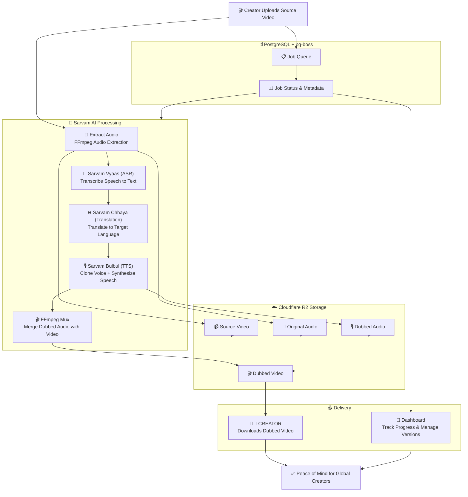

# Dubzy

> **A smart, zero-friction multilingual video dubbing platform for independent creators and educators, powered by Sarvam AI.**

Dubzy is an event-driven video dubbing pipeline that transforms finished source videos into localized versions in multiple languages. By leveraging Sarvam's state-of-the-art Indic language models, we turn complex video processing into seamless, automated dubbing while keeping upload, processing progress, and completed downloads in one unified workspace.

---
## Architecture Diagram


## 🎥 Demo Video

See Dubzy in action

[(Video Link)](https://x.com/vishalsingh2972/status/2065684282203644147?s=20)

----
## 📌 Project Overview

When a creator uploads a finished video, Dubzy orchestrates a sophisticated AI-powered dubbing pipeline:

1. **Audio Extraction:** FFmpeg extracts the audio track from the source video.
2. **Transcription:** Sarvam Vyaas transcribes the speech into text with speaker diarization.
3. **Translation:** Sarvam Chhaya translates the transcript into the target language while preserving context, tone, and cultural nuances.
4. **Voice Cloning & Synthesis:** Sarvam Bulbul clones the original speaker's voice and synthesizes the translated text in the target language.
5. **Video Muxing:** FFmpeg merges the dubbed audio with the original video, replacing the audio track while maintaining video quality.
6. **Delivery:** The creator downloads the completed dubbed video or adds additional language versions.

**Dubzy** is an event-driven asynchronous pipeline that transforms video content into multilingual versions while preserving the creator's voice and style.

---

## 👨‍💼 Real-World Example: Rajesh (Mumbai) & His Tech Tutorials

> "Rajesh is a programming instructor in Mumbai who creates high-quality Python tutorials in Hindi. He wants to reach Telugu and Tamil-speaking students across India, but recording separate versions for each language would take months.
> Instead, Rajesh uploads his finished Hindi video to **Dubzy** and selects Telugu and Tamil as target languages.
> Within minutes, he receives two perfectly dubbed versions—one in Telugu, one in Tamil—both with his own cloned voice speaking the translated content. The lip-sync is natural, the tone matches his teaching style, and the video quality remains pristine.
> Rajesh publishes all three versions on his channel, reaching 3x the audience without recording a single additional video. His students in Telangana and Tamil Nadu feel like he's speaking directly to them in their mother tongue."

---

## 💭 The Problem Space

For content creators and educators looking to reach global audiences, video dubbing presents significant challenges:

* **Time-Consuming:** Recording separate versions for each language requires hours of studio time and coordination.
* **Expensive:** Professional voice actors, studios, and video editors for multiple languages cost thousands of dollars.
* **Voice Consistency:** Maintaining the same tone, energy, and personality across different languages is nearly impossible with different voice actors.
* **Quality Degradation:** Traditional dubbing often loses the emotional context and cultural nuances of the original content.
* **Scalability:** Adding a new language version means starting the entire production process from scratch.

---

## 🧠 Core System Processing Lifecycle

```txt
[Creator Video Upload] ──> [Express API] ──> (Fast HTTP 200 ACK) ──> [pg-boss Job Queue]
                                                                                │
                                                                    (Async Worker Processing)
                                                                                │
                                                                                ▼
                                                                    [FFmpeg Audio Extraction]
                                                                                │
                                                                                ▼
                                                                         [Sarvam Vyaas ASR]
                                                               (Speech-to-Text Transcription)
                                                                                │
                                                                                ▼
                                                                  [Sarvam Chhaya Translation]
                                                                  (Context-Aware Translation)
                                                                                │
                                                                                ▼
                                                                        [Sarvam Bulbul TTS]
                                                                  (Voice Cloning + Synthesis)
                                                                                │
                                                                                ▼
                                                                      [FFmpeg Video Muxing]
                                                               (Merge Dubbed Audio + Video)
                                                                                │
                                                                                ▼
                                                                      [Cloudflare R2 Storage]
                                                                       (Permanent Media URL)
                                                                                │
                                                                                ▼
                                                                    [PostgreSQL State Update]
                                                                      (Job Status: Completed)
                                                                                │
                                                                                ▼
                                                                 [Creator Downloads Dubbed Video]
```

---

## 🛠️ Tech Stack & Engineering Rationale

| Architecture Layer | Technology | Engineering Selection Reason |
| --- | --- | --- |
| **Frontend Platform** | **React + Vite + TypeScript** | Fast development, excellent DX, and optimal bundle sizes. |
| **Backend API** | **Express + TypeScript** | Lightweight, flexible REST API with strong TypeScript support. |
| **Database & ORM** | **PostgreSQL + Drizzle ORM** | Relational data integrity with type-safe queries and migrations. |
| **Job Queue** | **pg-boss** | PostgreSQL-native job queue with no external dependencies. |
| **Authentication** | **Better Auth** | Modern, secure authentication with email/password and admin approval flows. |
| **Media Storage** | **Cloudflare R2** | Zero egress costs, S3-compatible API, and global CDN distribution. |
| **Speech Recognition** | **Sarvam Vyaas** | Industry-leading Indic language ASR with speaker diarization. |
| **Translation** | **Sarvam Chhaya** | Context-aware translation preserving tone, culture, and code-mixing. |
| **Voice Synthesis** | **Sarvam Bulbul** | Natural TTS with voice cloning capabilities for personalized dubbing. |
| **Media Processing** | **FFmpeg/FFprobe** | Industry-standard tooling for audio extraction, processing, and muxing. |
| **Validation** | **Zod** | Runtime type safety and schema validation across the stack. |

---

## 📋 Dubbing Job State Machine

* **`pending`**: Job created, waiting for worker to pick up.
* **`processing`**: Worker is actively processing (transcribing, translating, synthesizing, muxing).
* **`completed`**: Dubbed video successfully generated and stored in R2.
* **`failed`**: Job encountered an error; error details stored for debugging.

**Job Lifecycle:**
```
pending ──> processing ──> completed
                │
                └──> failed
```

---

## 🚀 What I Learned from this Project

- Building Dubzy taught me how to orchestrate complex AI pipelines where multiple services (ASR, translation, TTS, video processing) must work in sequence with fault tolerance.
- I learned the importance of async job processing with `pg-boss`—keeping the API responsive while heavy AI/FFmpeg tasks run in the background is critical for user experience.
- Working with Sarvam AI's Indic language models showed me the complexity of preserving voice identity, tone, and cultural context across languages. Voice cloning isn't just about accuracy; it's about maintaining the speaker's personality.
- FFmpeg integration for video/audio muxing required deep understanding of codec compatibility, quality preservation, and format handling across different source videos.
- Building a multi-version workspace (one source video → multiple dubbed versions) taught me database design patterns for managing related entities and their lifecycles.
- This project reinforced that production-ready AI applications require careful error handling, state management, and user feedback at every step of a long-running pipeline.
- I'm excited to explore more advanced features like real-time preview, subtitle generation, and multi-speaker voice cloning in future iterations.

---

## 🏗️ Architecture

- **Frontend:** React, Vite, and TypeScript
- **Backend:** Express, Drizzle ORM, PostgreSQL, Better Auth, Cloudflare R2, and `pg-boss` job publishing
- **Worker:** TypeScript and `pg-boss`, with Sarvam for transcription and translation, Smallest for voice cloning and speech synthesis, Cloudflare R2 for media storage, and FFmpeg/ffprobe for media processing

---

## 📁 Repository Map

```text
frontend/          React web application
backend/           Express API, authentication, persistence, and job publishing
worker/            Background dubbing pipeline and deployment configuration
docker-compose.yml Local PostgreSQL service
```

---

## 🛠️ Local Development

Each service is an independent package. Copy its checked-in environment template before starting, then provide the required local credentials and service URLs:

```bash
cp frontend/.env.example frontend/.env
cp backend/.env.example backend/.env
cp worker/.env.example worker/.env
```

Start PostgreSQL from the repository root with `docker compose up -d db`. Install dependencies in `frontend/`, `backend/`, and `worker/`, then use each package's scripts:

| Service | Development | Build | Other checks |
| --- | --- | --- | --- |
| Frontend | `npm run dev` | `npm run build` | `npm run lint`, `npm test` |
| Backend | `npm run dev` | `npm run build` | `npm run lint`, `npm test`, `npm run db:push` |
| Worker | `npm run dev` | `npm run build` | `npm test` |

The worker also requires FFmpeg and ffprobe on its runtime path. See [the worker deployment guide](worker/README.md) for its Docker-based deployment and operational commands.